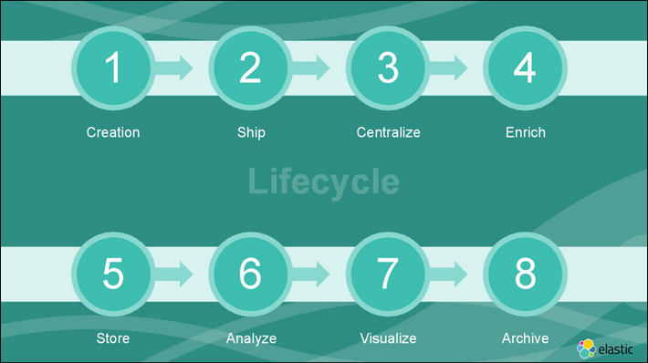

# awesome-logging
Logging, for analytics, statistic, troubleshooting, ..., is super hard, especially in medium and big systems. 

## Logging Lifetime
||
|:--:|
|*Credit: ElasticSearch*|

## Logging Infrastructure

## Logging Shippers
- syslog
- syslog-ng
- Logstash by ElasticSearch
- Fluentd by Apache
- Flume 
- Scribe by Facebook
- Kafka by LinkedIn

## Logging Format

## Documentations
### Blog posts
- [Filebeat vs. Logstash — The Evolution of a Log Shipper](https://logz.io/blog/filebeat-vs-logstash/) by Elastic

### Slides
- [
Awesome Logging Infrastructure Using The Elastic Stack](https://speakerdeck.com/elastic/awesome-logging-infrastructure-using-the-elastic-stack) by Elastic

